# Droidcon Uganda - App

This is the open-source app for [Droidcon Uganda](https://www.uganda.droidcon.com/) that showcases the event program, helping attendees navigate the schedule, discover speakers, and plan their participation.

## Table of Contents
- [Introduction](#introduction)
- [Features](#features)
- [Installation](#installation)
- [Usage](#usage)
- [Contributing](#contributing)
- [License](#license)

## Introduction

Droidcon Uganda is an annual conference focused on Android development, offering various talks, workshops, and networking opportunities for Android developers. This app provides the program of the event, allowing attendees to easily access the schedule, speaker details, session descriptions, and more.

The app is designed to help you navigate the event and stay up to date with the various activities happening during the conference.

## ScreenShots
### Android
<table>
<tr>
<td>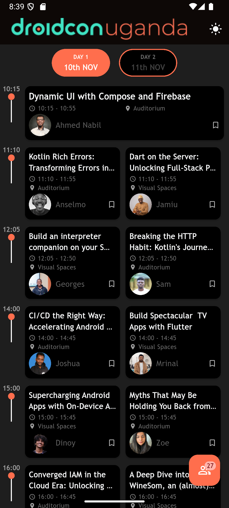</td>
<td>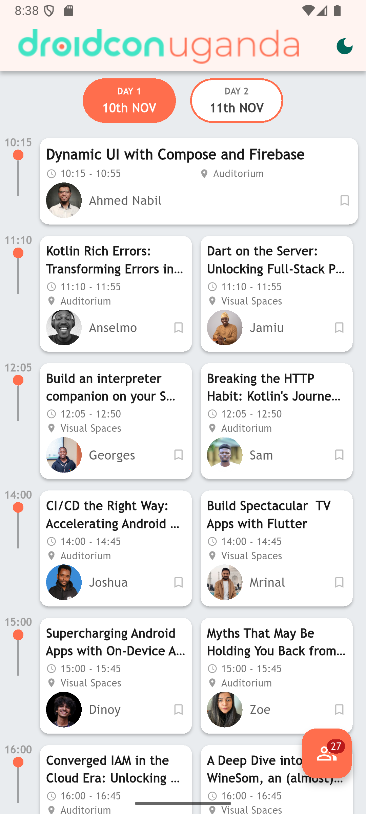</td>
<td>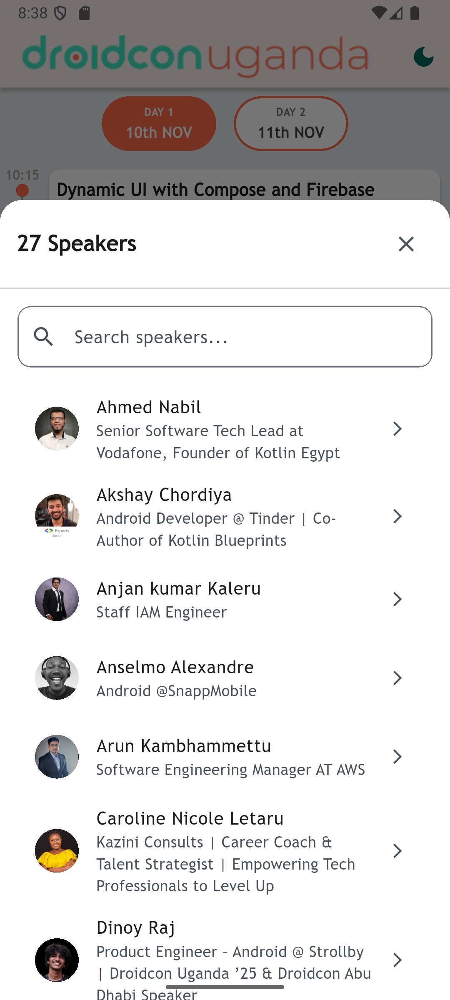</td>
<td></td>
<td>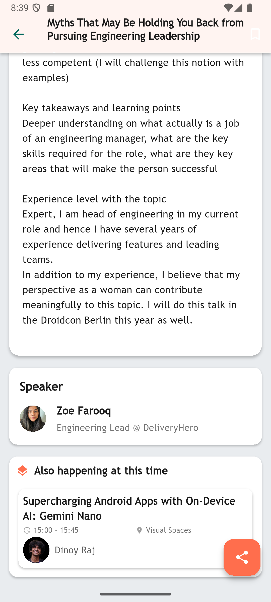</td>
</tr>
</table>

### iPhone
<table>
<tr>
<td>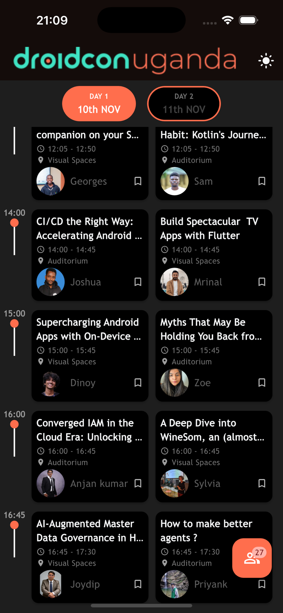</td>
<td>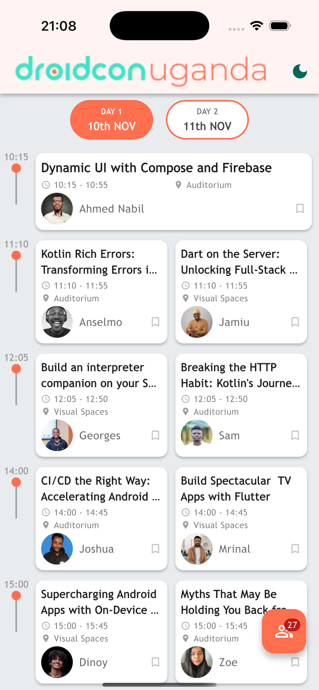</td>
<td>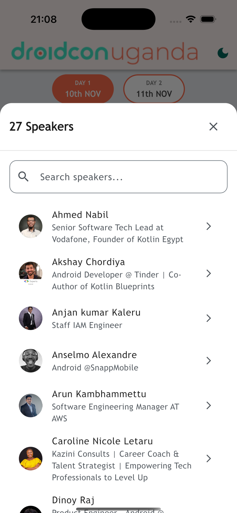</td>
<td>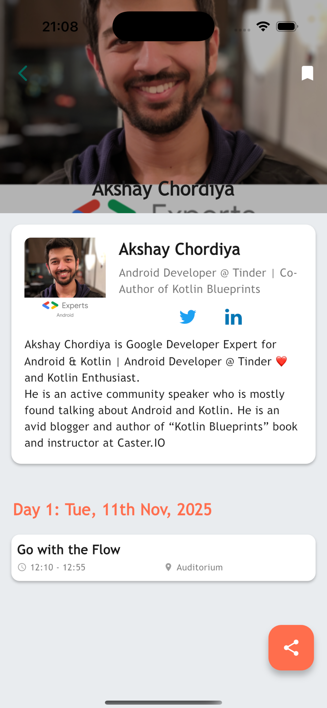</td>
<td>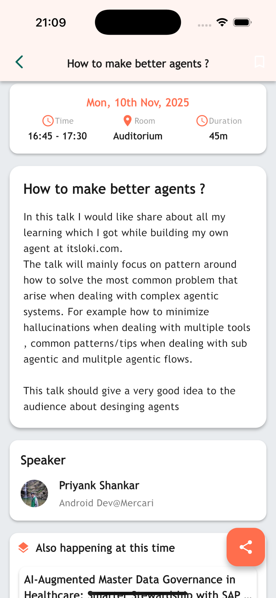</td>
</tr>
</table>

### iPad
<table>
<tr>
<td>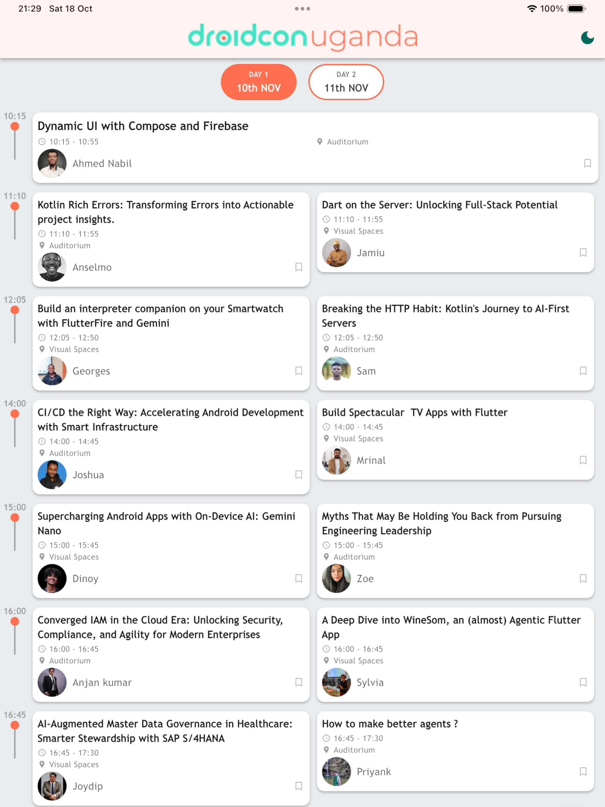</td>
<td>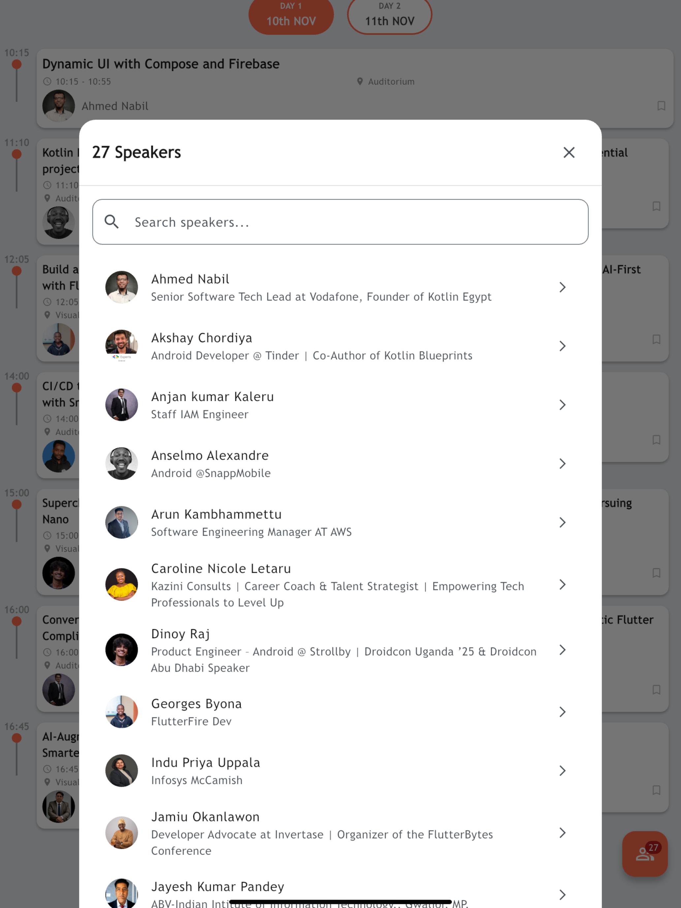</td>
<td>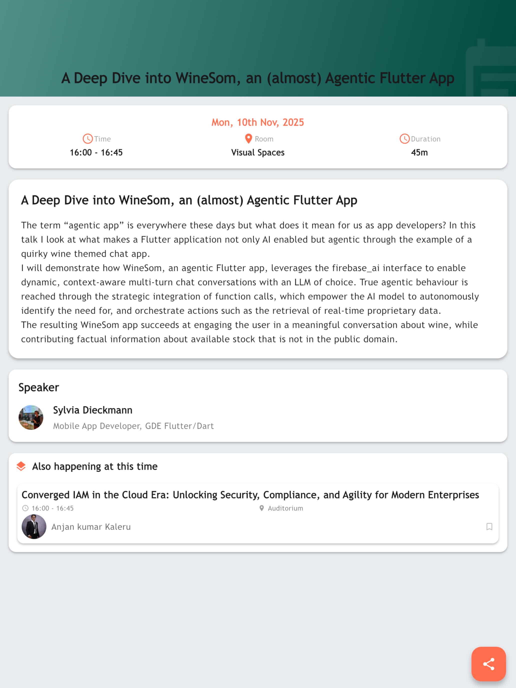</td>
</tr>
</table>

## Features

- **Event Schedule**: Browse the conference program with sessions, dates, and times.
- **Speakers**: Discover speakers and their topics.
- **Session Details**: View detailed information about each session, including descriptions and speaker bios.
- **Favorite Sessions**: Mark sessions as favorites and get notifications about them.
- **Notifications**: Receive reminders about upcoming sessions and events.
- **Interactive UI**: Easy-to-use, responsive, and visually appealing interface.

## Installation

To run the app locally on your machine, follow these steps:

### Prerequisites

- [Flutter](https://flutter.dev/docs/get-started/install) installed on your machine
- [Android Studio](https://developer.android.com/studio) or any other IDE that supports Flutter

### Steps

1. Clone the repository:

```bash
git clone https://github.com/SiroDevs/DroidconUg.git
```

2. Navigate into the project directory:

```bash
cd DroidconUg
```

3. Install the dependencies:

```bash
flutter pub get
```

4. Update code generated files:

```bash
dart run build_runner build --delete-conflicting-outputs
```

5. Update localization strings:

```bash
flutter gen-l10n
```

6. Run the app:

```bash
flutter run
```

## Usage

Once the app is installed, you can open it to:

- View the complete program for Droidcon Uganda
- Search for sessions by date, speaker, or topic
- Add sessions to your favorites
- Set up notifications for important sessions

### Example Screenshots

(Include some screenshots of the app here to showcase the program, session details, etc.)

## Contributing

We welcome contributions to the Droidcon Uganda Program App! If you'd like to contribute, please follow these steps:

1. **Fork the repository** to your GitHub account.
2. **Clone the forked repository** to your local machine:

    ```bash
    git clone https://github.com/SiroDaves/DroidconUg.git
    ```

3. **Create a new branch** for your changes:

    ```bash
    git checkout -b your-branch-name
    ```

4. **Make your changes** to the code, and then **add the changes** to the staging area using the following command:

    ```bash
    git add file-name
    ```

    Replace `file name` with the name of the file you are staging

5. **Commit your changes** with a message that describes the changes you made:

    ``` bash
    git commit -m " Add a suitable commit message"
    ```


6. **Push the changes** to your branch on GitHub:

    ```bash
    git push -u origin your-branch-name
    ```

   Replace `your-branch-name` with the name of the branch you created earlier.

7. **Open a pull request** from your branch to the main repository.

Please ensure that your code follows the [Flutter style guide](https://dart.dev/guides/language/effective-dart) and includes appropriate tests.

## License

